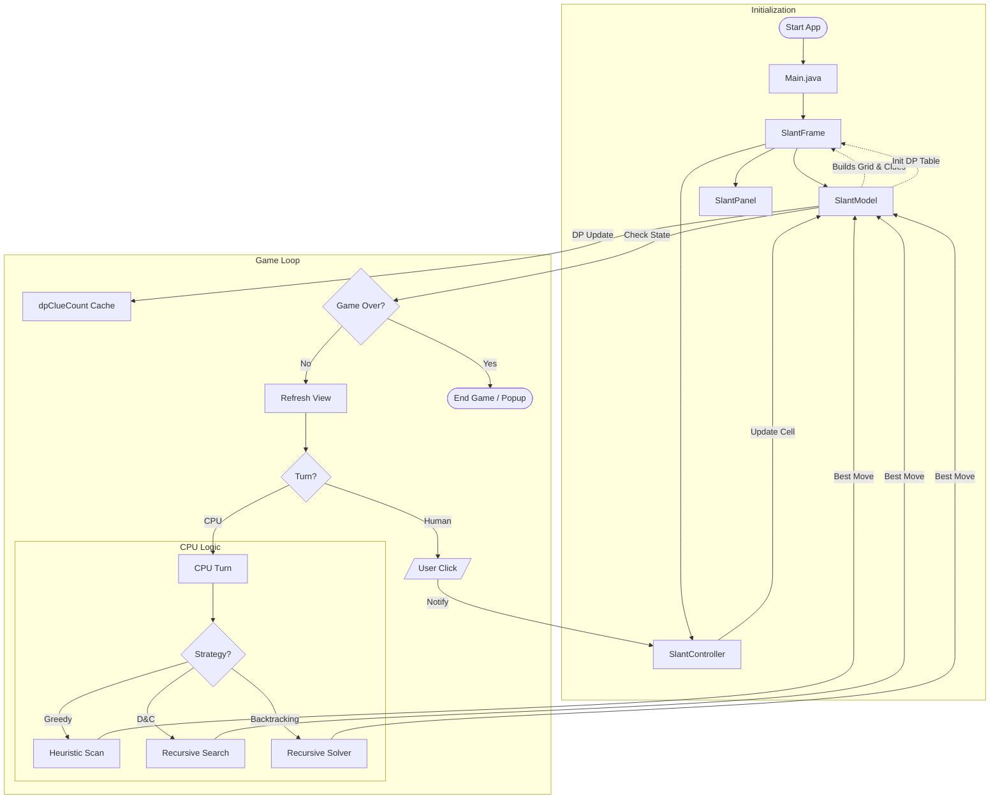

# Slant Game Workflow

This document explains the step-by-step flow of the game, from launching the application to winning or losing.

## 1. Game Flow Diagram

## 2. Text Explanation

### A. Initialization (Start)
*   **Main Entry**: The app starts in `Main.java`.
*   **Setup**: It creates the `SlantFrame` (Window), which initializes:
    *   **Model** (`SlantModel`): Creates the grid, generates a valid solution, calculates clue numbers, and initializes the **DP table** (`dpClueCount`).
    *   **View** (`SlantPanel`): Draws the grid with a dark theme, glowing slant lines, and colored clue indicators.
    *   **Controller** (`SlantController`): Connects clicks to game logic, manages CPU strategies.

### B. The Game Loop (Playing)

#### Human Turn
1.  **Click**: You click a cell.
2.  **Controller Action**: `SlantController.onCellClicked` is triggered.
3.  **Update Model**: The Controller tells the Model to update that cell (add `/`, `\`, or clear).
4.  **DP Update**: The Model incrementally updates only the **4 affected corner nodes** in `dpClueCount` (O(1) per move).
5.  **Refresh View**: The View repaints to show the new line.
6.  **Check Status**:
    *   **Win**: Board is full, correct, and loop-free → **VICTORY!**
    *   **Loss**: Board is full but has errors → **GAME OVER.**
    *   **Continue**: Pass turn to CPU.

#### CPU Turn (AI)
1.  **Trigger**: CPU's turn starts after a 1-second delay.
2.  **Strategy** (selected via difficulty):
    *   **Greedy** (Review 1): Scans all empty cells, sorts by adjacent clue count, picks the best.
    *   **Divide & Conquer** (Review 2): Recursively splits grid into 4 quadrants, merges sorted results.
    *   **Backtracking** (Review 3): Tries both `/` and `\` for each cell, recursively solves forward, backtracks on constraint violation.
3.  **Constraint Checks**: Uses `hasLoops()` (Union-Find) and `getDPClueCount()` (DP cache) for validation.
4.  **Fallback**: If strategy fails, falls back to Greedy → then random cell.
5.  **Switch Back**: Turn goes back to the Player.

### C. Dynamic Programming (Optimization Layer)
*   **Not a CPU strategy** — works silently in the Model for all strategies.
*   `dpClueCount[][]` caches line counts at each node intersection.
*   Updated incrementally on every `setSlant()` call.
*   Used by Backtracking's `isConstraintSatisfied()` for fast constraint checks.
*   **Performance**: O(N) → O(1) per move validation.

### D. End Game
*   A popup message shows "Victory" or "Game Over".
*   You can start a **New Game** from the menu, which resets the entire process.
