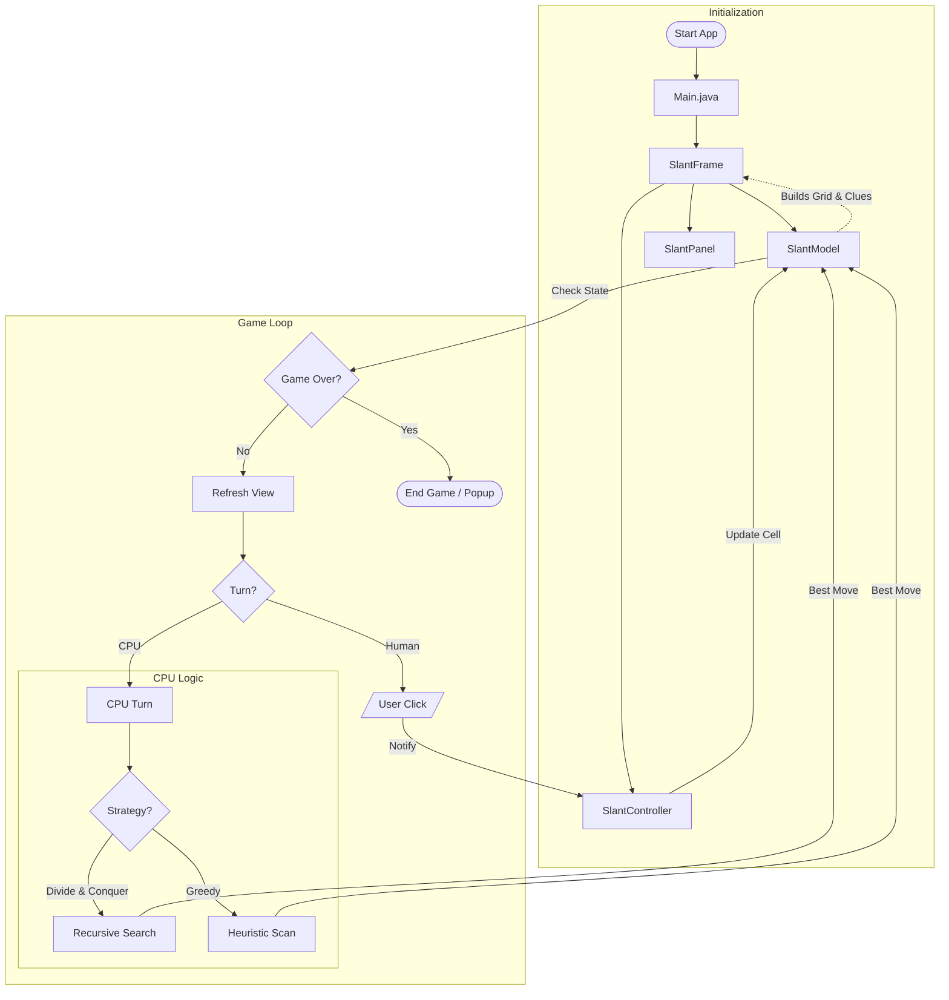

# Slant Game Workflow

This document explains the step-by-step flow of the game, from launching the application to winning or losing.

## 1. Game Flow Diagram

## 2. Text Explanation

### A. Initialization (Start)
*   **Main Entry**: The app starts in `Main.java`.
*   **Setup**: It creates the `SlantFrame` (Window), which initializes:
    *   **Model** (`SlantModel`): The brain. It creates the grid, generates a valid solution, but hides it. It then calculates the clues numbers.
    *   **View** (`SlantPanel`): The visual board. It draws the grid lines and clues based on the Model.
    *   **Controller** (`SlantController`): The manager. It connects the user's clicks to the game logic.

### B. The Game Loop (Playing)
The game waits for **Events** (User Clicks).

#### Human Turn
1.  **Click**: You click a cell.
2.  **Controller Action**: `SlantController.onCellClicked` is triggered.
3.  **Update Model**: The Controller tells the Model to update that cell (add `/`, `\`, or clear).
4.  **Refresh View**: The View repaints to show the new line.
5.  **Check Status**:
    *   **Win**: If the board is full, correct, and loop-free -> **VICTORY!**
    *   **Loss**: If the board is full but has errors -> **GAME OVER.**
    *   **Continue**: If strictly playing turn-based, pass turn to CPU.

#### CPU Turn (AI)
1.  **Trigger**: If it's the CPU's turn.
2.  **Strategy**: The CPU decides a move using **Divide & Conquer** (default) or **Greedy**.
    *   *Divide & Conquer*: Recursively splits grid to find the best spot.
    *   *Greedy*: Scans for the cell with the most clues.
3.  **Execute**: CPU updates the Model.
4.  **Switch Back**: Turn goes back to the Player.

### C. End Game
*   A popup message shows "Victory" or "Game Over".
*   You can start a **New Game** from the menu, which resets the entire process (Step 1).
