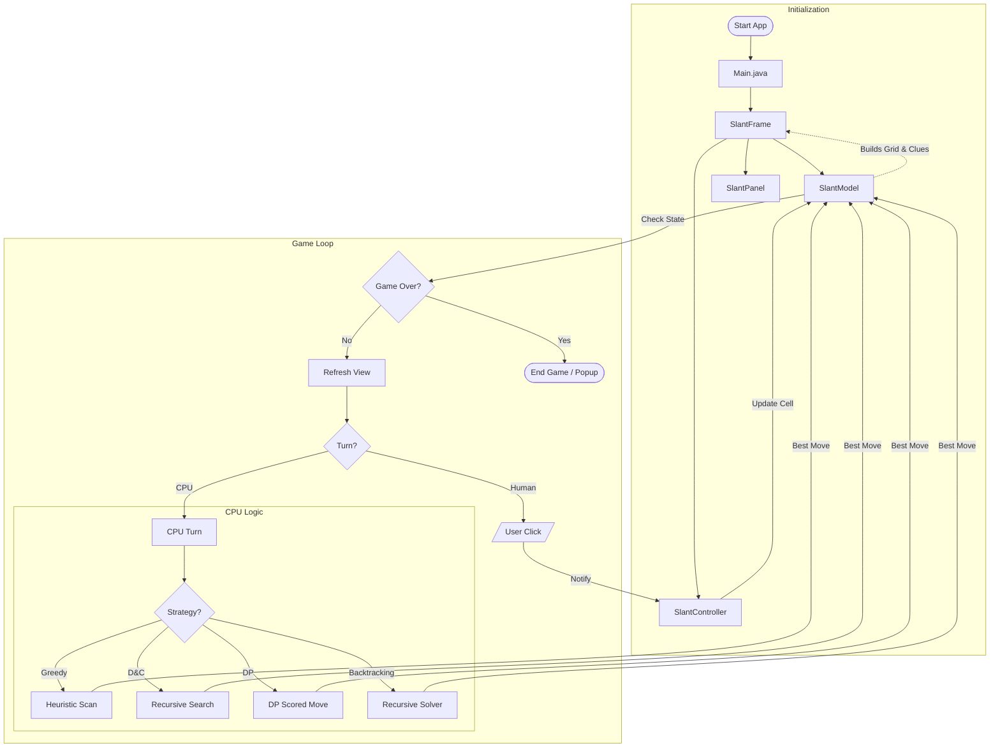

# Slant Game - Algorithmic Project

Welcome to the Slant Game, a Java implementation of the popular logic puzzle from Simon Tatham's Puzzle Collection. This project demonstrates the application of key algorithm design paradigms including **Greedy**, **Divide & Conquer**, **Dynamic Programming**, and **Backtracking**.

## 🎮 How to Play
The objective is to fill a grid with diagonal lines (slants) such that:
1.  Every clue number (0-4) has exactly that many lines connecting to it.
2.  There are no closed loops.

### Controls
- **Left Click**: Place a forward slant (`\`)
- **Right Click**: Place a backward slant (`/`)
- **Click Again**: Toggle or remove slant.

---

## 🚀 How to Run

### Prerequisites
- Java JDK 8 or higher installed.

### 1. Compile the Project
Open your terminal in the project root folder and run:
```bash
cd Slant
javac -d out -sourcepath src/main/java src/main/java/slant/Main.java
```

### 2. Run the Game
```bash
java -cp out slant.Main
```

### 3. Run Tests (Optional)
To verify the logic and algorithms:
```bash
java -cp out slant.SlantTest
```

---

## 🧠 Algorithmic Implementation

This project implements the CPU logic using four distinct algorithm design paradigms as per the course requirements.

### 1. Review 2: Divide & Conquer (Primary Strategy)
The CPU primarily uses a **Divide & Conquer** strategy to determine its moves.
- **Divide**: The board is recursively split into 4 quadrants (Top-Left, Top-Right, Bottom-Left, Bottom-Right).
- **Conquer**: When a region is small enough (Base Case), the CPU evaluates valid moves.
- **Combine**: The results from sub-regions are merged together to form a ranked list of best moves.

### 2. Review 1: Greedy Algorithm (Fallback Strategy)
A **Greedy Algorithm** is also implemented as a robust fallback mechanism.
- **Logic**: It performs a linear scan of the entire board and greedily picks the cell with the most adjacent constraints (clues), without looking ahead.
- **Role**: This strategy kicks in if the D&C recursion hits an edge case or fails to find a move, ensuring the CPU never freezes.

### 3. Sorting (Custom Implementation)
- **Algorithm**: **Merge Sort**
- **Implementation**: A custom Merge Sort algorithm is implemented from scratch (not using `Collections.sort`) to rank the candidate moves.
- **Usage**: Used during the "Combine" phase of the Divide & Conquer strategy to ensure the CPU always picks the optimal move globally.

### 4. Review 3: Dynamic Programming (Optimized Validation)
The game uses **Dynamic Programming** to cache and optimize clue validation.
- **DP Table**: A `dpClueCount[][]` table stores the current line count at each node intersection.
- **Incremental Update**: When a slant is placed (`setSlant()`), only the **4 affected corner nodes** are updated — not the entire board.
- **Move Scoring**: `getDPMoveScore()` uses cached DP values to evaluate how beneficial a move would be.
- **Complexity**: O(N) → **O(1)** per move validation.

### 5. Review 3: Backtracking (CPU Solver)
The CPU uses a **Backtracking** algorithm for intelligent move selection.
- **Logic**: Finds an empty cell, tries placing `/` or `\`, validates constraints (no loops + clue satisfaction).
- **Recursion**: If valid, recursively continues to the next cell. If invalid, **undoes the move** (backtracks) and tries the other direction.
- **Pruning**: Constraint checks prune invalid states early, avoiding exhaustive search.
- **Complexity**: O(2^N) worst case, heavily pruned by constraints.

---

## 📊 Algorithm Analysis

| Algorithm | Time Complexity | Space Complexity |
|---|---|---|
| Greedy | O(N) | O(N) |
| Merge Sort | O(N log N) | O(N) |
| Quick Sort | O(N log N) avg, O(N²) worst | O(log N) |
| D&C CPU Strategy | O(N log N) | O(N) |
| Union-Find (Loop Detection) | O(α(N)) ≈ O(1) | O(N) |
| **DP (Clue Validation)** | **O(1) per move** | **O(N)** |
| **Backtracking (Solver)** | **O(2^N) worst, pruned** | **O(N)** |

---

## 🔄 Game Workflow Diagram



---

## 📂 Project Structure
- `src/main/java/slant/Main.java`: Entry point of the application.
- `src/main/java/slant/controller/SlantController.java`: Contains **CPU AI** with **Greedy**, **D&C**, **DP**, and **Backtracking** strategies.
- `src/main/java/slant/model/SlantModel.java`: Data structure for grid, clues, loop detection (DSU), and **DP table** (`dpClueCount`).
- `src/main/java/slant/algorithm/DivideAndConquer.java`: Generic **Merge Sort** and **Quick Sort** implementations.
- `src/main/java/slant/view`: GUI components using Java Swing.
